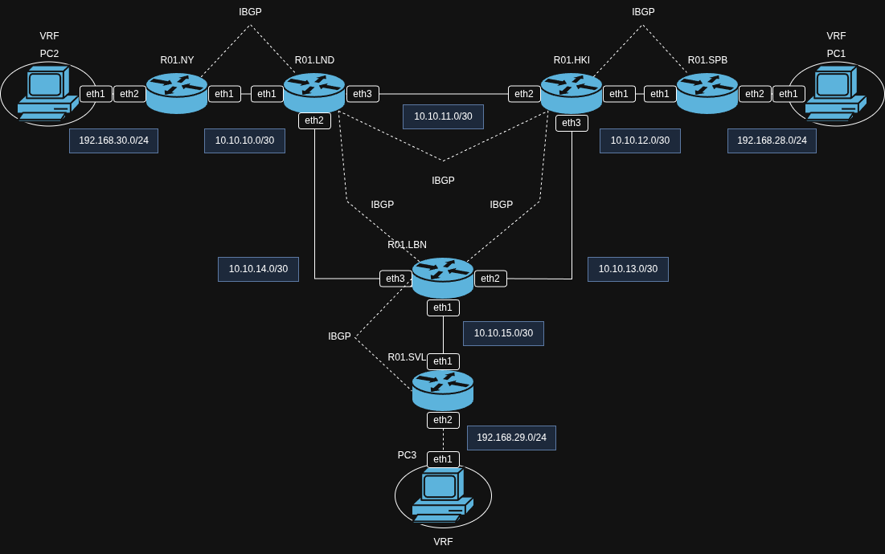
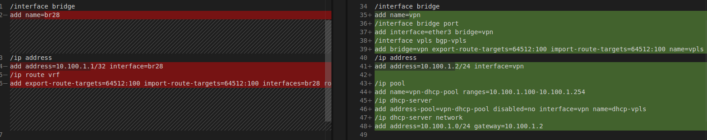

# Лабораторная работа №3

## Задание

<https://itmo-ict-faculty.github.io/introduction-in-routing/education/labs2023_2024/lab4/lab4/>


### Топология

```
name: lab-4-part-1
mgmt:
  network: lab-4-part-1
  ipv4-subnet: 172.10.0.0/24

topology:
  kinds:
    vr-ros:
      image: vrnetlab/mikrotik_routeros:6.47.9

  nodes:
    R01.SPB:
      kind: vr-ros
      mgmt-ipv4: 172.10.0.101
      startup-config: configs/R01.SPB.rsc
    R01.HKI:
      kind: vr-ros
      mgmt-ipv4: 172.10.0.102
      startup-config: configs/R01.HKI.rsc
    R01.SVL:
      kind: vr-ros
      mgmt-ipv4: 172.10.0.103
      startup-config: configs/R01.SVL.rsc
    R01.LND:
      kind: vr-ros
      mgmt-ipv4: 172.10.0.104
      startup-config: configs/R01.LND.rsc
    R01.LBN:
      kind: vr-ros
      mgmt-ipv4: 172.10.0.105
      startup-config: configs/R01.LBN.rsc
    R01.NY:
      kind: vr-ros
      mgmt-ipv4: 172.10.0.106
      startup-config: configs/R01.NY.rsc
    PC1:
      kind: linux
      image: alpine:latest
      mgmt-ipv4: 172.10.0.2
      binds:
        - ./configs:/configs
      exec:
        - sh /configs/PC.sh
    PC2:
      kind: linux
      image: alpine:latest
      mgmt-ipv4: 172.10.0.3
      binds:
        - ./configs:/configs
      exec:
        - sh /configs/PC.sh
    PC3:
      kind: linux
      image: alpine:latest
      mgmt-ipv4: 172.10.0.4
      binds:
        - ./configs:/configs
      exec:
        - sh /configs/PC.sh


  links:
    - endpoints: ["R01.SPB:eth1","R01.HKI:eth1"]
    - endpoints: ["R01.NY:eth1","R01.LND:eth1"]
    - endpoints: ["R01.SVL:eth1","R01.LBN:eth1"]
    - endpoints: ["R01.HKI:eth2","R01.LND:eth3"]
    - endpoints: ["R01.HKI:eth3","R01.LBN:eth2"]
    - endpoints: ["R01.LND:eth2","R01.LBN:eth3"]
    - endpoints: ["R01.SPB:eth2","PC1:eth1"]
    - endpoints: ["R01.NY:eth2","PC2:eth1"]
    - endpoints: ["R01.SVL:eth2","PC3:eth1"]

```

Ниже представлена схема сети в draw.io:



### Часть 1
### Настройка маршрутизаторов

Конфигурация для R01.HKI, R01.LBN, R01.LND включает OSPF для обмена маршрутами, MPLS LDP для транспорта и BGP с поддержкой VPNv4/L2VPN для обмена VPN-маршрутами с другими маршрутизаторами, используя Loopback-адрес в качестве идентификатора. Маршрутизатор настроен как route-reflector для пиров LND и LBN, что упрощает мешинг BGP в сети.

```
/ip address
add address=10.10.12.2/30 interface=ether2
add address=10.10.11.1/30 interface=ether3
add address=10.10.13.2/30 interface=ether4

/interface bridge
add name=loopback
/ip address 
add address=10.255.255.2/32 interface=loopback network=10.255.255.2

/routing ospf instance
add name=inst router-id=10.255.255.2
/routing ospf area
add name=backbonev28 area-id=0.0.0.0 instance=inst
/routing ospf network
add area=backbonev28 network=10.10.12.0/30
add area=backbonev28 network=10.10.11.0/30
add area=backbonev28 network=10.10.13.0/30
add area=backbonev28 network=10.255.255.2/32

/mpls ldp
set lsr-id=10.255.255.2
set enabled=yes transport-address=10.255.255.2
/mpls ldp interface
add interface=ether2
add interface=ether3
add interface=ether4

/routing bgp instance
set default as=64512 router-id=10.255.255.2
/routing bgp peer
add name=SPB address-families=l2vpn,vpnv4 remote-address=10.255.255.5 remote-as=64512 update-source=loopback route-reflect=no
add name=LND address-families=l2vpn,vpnv4 remote-address=10.255.255.3 remote-as=64512 update-source=loopback route-reflect=yes
add name=LBN address-families=l2vpn,vpnv4 remote-address=10.255.255.4 remote-as=64512 update-source=loopback route-reflect=yes
/routing bgp network
add network=10.255.255.0/24

/user
add name=paninanq password=paninanq group=full
remove admin
/system identity
set name=R01.HKI
```

Настройка R01.SPB, R01.SVL и R01.NY представлена ниже. Добавлен DHCP-сервер для клиентской сети и отдельный VRF для изоляции клиентского трафика через L2VPN.


```
/ip address
add address=10.10.12.1/30 interface=ether2
add address=192.168.10.1/24 interface=ether3

/ip pool
add name=dhcp-pool ranges=192.168.10.10-192.168.10.100
/ip dhcp-server
add address-pool=dhcp-pool disabled=no interface=ether3 name=dhcp-server
/ip dhcp-server network
add address=192.168.10.0/24 gateway=192.168.10.1

/interface bridge
add name=loopback
/ip address 
add address=10.255.255.5/32 interface=loopback network=10.255.255.5

/routing ospf instance
add name=inst router-id=10.255.255.5
/routing ospf area
add name=backbonev28 area-id=0.0.0.0 instance=inst
/routing ospf network
add area=backbonev28 network=10.10.12.0/30
add area=backbonev28 network=192.168.10.0/24
add area=backbonev28 network=10.255.255.5/32

/mpls ldp
set lsr-id=10.255.255.5
set enabled=yes transport-address=10.255.255.5
/mpls ldp interface
add interface=ether2

/routing bgp instance
set default as=64512 router-id=10.255.255.5
/routing bgp peer
add name=HKI remote-address=10.255.255.2 address-families=l2vpn,vpnv4 remote-as=64512 update-source=loopback route-reflect=no 
/routing bgp network
add network=10.255.255.0/24

/interface bridge 
add name=br28
/ip address
add address=10.100.1.1/32 interface=br28
/ip route vrf
add export-route-targets=64512:100 import-route-targets=64512:100 interfaces=br28 route-distinguisher=64512:100 routing-mark=VRF
/routing bgp instance vrf
add redistribute-connected=yes routing-mark=VRF

/user
add name=paninanq password=paninanq group=full
remove admin
/system identity
set name=R01.SPB
```


### Результат работы

При деплое сети получаем:

`containerlab deploy`

```
03:37:57 INFO Parsing & checking topology file=lab-4-part-1.clab.yaml
03:37:57 INFO Parsing & checking topology file=lab-4-part-1.clab.yaml
03:37:57 INFO Destroying lab name=lab-4-part-1
03:37:58 INFO Removed container name=clab-lab-4-part-1-PC3
03:37:58 INFO Removed container name=clab-lab-4-part-1-PC1
03:37:58 INFO Removed container name=clab-lab-4-part-1-PC2
03:37:58 INFO Removed container name=clab-lab-4-part-1-R01.SVL
03:37:58 INFO Removed container name=clab-lab-4-part-1-R01.NY
03:37:58 INFO Removed container name=clab-lab-4-part-1-R01.LND
03:37:58 INFO Removed container name=clab-lab-4-part-1-R01.HKI
03:37:58 INFO Removed container name=clab-lab-4-part-1-R01.SPB
03:37:58 INFO Removed container name=clab-lab-4-part-1-R01.LBN
03:37:58 INFO Removing host entries path=/etc/hosts
03:37:58 INFO Removing SSH config path=/etc/ssh/ssh_config.d/clab-lab-4-part-1.conf
03:37:58 INFO Containerlab started version=0.70.2
03:37:58 INFO Parsing & checking topology file=lab-4-part-1.clab.yaml
03:37:58 INFO Creating docker network name=lab-4-part-1 IPv4 subnet=172.10.0.0/24 IPv6 subnet="" MTU=0
03:37:58 INFO Creating lab directory path=/home/paninanq/sem-5/2025_2026-introduction_in_routing-k3323-panina_a_s/lab4/part-1/clab-lab-4-part-1
03:37:59 INFO Creating container name=PC1
03:37:59 INFO Creating container name=R01.NY
03:37:59 INFO Creating container name=PC3
03:37:59 INFO Creating container name=PC2
03:37:59 INFO Creating container name=R01.HKI
03:37:59 INFO Creating container name=R01.SPB
03:37:59 INFO Creating container name=R01.SVL
03:37:59 INFO Creating container name=R01.LND
03:37:59 INFO Creating container name=R01.LBN
03:38:00 INFO Created link: R01.NY:eth2 ▪┄┄▪ PC2:eth1
03:38:00 INFO Created link: R01.NY:eth1 ▪┄┄▪ R01.LND:eth1
03:38:00 INFO Created link: R01.HKI:eth2 ▪┄┄▪ R01.LND:eth3
03:38:00 INFO Created link: R01.SPB:eth1 ▪┄┄▪ R01.HKI:eth1
03:38:00 INFO Created link: R01.HKI:eth3 ▪┄┄▪ R01.LBN:eth2
03:38:00 INFO Created link: R01.SVL:eth1 ▪┄┄▪ R01.LBN:eth1
03:38:00 INFO Created link: R01.SVL:eth2 ▪┄┄▪ PC3:eth1
03:38:00 INFO Created link: R01.LND:eth2 ▪┄┄▪ R01.LBN:eth3
03:38:00 INFO Created link: R01.SPB:eth2 ▪┄┄▪ PC1:eth1
03:38:47 INFO Executed command node=PC2 command="sh /configs/PC.sh" stdout=""
03:38:47 INFO Executed command node=PC1 command="sh /configs/PC.sh" stdout=""
03:38:47 INFO Executed command node=PC3 command="sh /configs/PC.sh" stdout=""
03:38:47 INFO Adding host entries path=/etc/hosts
03:38:47 INFO Adding SSH config for nodes path=/etc/ssh/ssh_config.d/clab-lab-4-part-1.conf
🎉 A newer containerlab version (0.72.0) is available!
Release notes: https://containerlab.dev/rn/0.72/
Run 'sudo clab version upgrade' or see https://containerlab.dev/install/ for installation options.
╭───────────────────────────┬───────────────────────────────────┬────────────────────┬────────────────╮
│            Name           │             Kind/Image            │        State       │ IPv4/6 Address │
├───────────────────────────┼───────────────────────────────────┼────────────────────┼────────────────┤
│ clab-lab-4-part-1-PC1     │ linux                             │ running            │ 172.10.0.2     │
│                           │ alpine:latest                     │                    │ N/A            │
├───────────────────────────┼───────────────────────────────────┼────────────────────┼────────────────┤
│ clab-lab-4-part-1-PC2     │ linux                             │ running            │ 172.10.0.3     │
│                           │ alpine:latest                     │                    │ N/A            │
├───────────────────────────┼───────────────────────────────────┼────────────────────┼────────────────┤
│ clab-lab-4-part-1-PC3     │ linux                             │ running            │ 172.10.0.4     │
│                           │ alpine:latest                     │                    │ N/A            │
├───────────────────────────┼───────────────────────────────────┼────────────────────┼────────────────┤
│ clab-lab-4-part-1-R01.HKI │ vr-ros                            │ running            │ 172.10.0.102   │
│                           │ vrnetlab/mikrotik_routeros:6.47.9 │ (health: starting) │ N/A            │
├───────────────────────────┼───────────────────────────────────┼────────────────────┼────────────────┤
│ clab-lab-4-part-1-R01.LBN │ vr-ros                            │ running            │ 172.10.0.105   │
│                           │ vrnetlab/mikrotik_routeros:6.47.9 │ (health: starting) │ N/A            │
├───────────────────────────┼───────────────────────────────────┼────────────────────┼────────────────┤
│ clab-lab-4-part-1-R01.LND │ vr-ros                            │ running            │ 172.10.0.104   │
│                           │ vrnetlab/mikrotik_routeros:6.47.9 │ (health: starting) │ N/A            │
├───────────────────────────┼───────────────────────────────────┼────────────────────┼────────────────┤
│ clab-lab-4-part-1-R01.NY  │ vr-ros                            │ running            │ 172.10.0.106   │
│                           │ vrnetlab/mikrotik_routeros:6.47.9 │ (health: starting) │ N/A            │
├───────────────────────────┼───────────────────────────────────┼────────────────────┼────────────────┤
│ clab-lab-4-part-1-R01.SPB │ vr-ros                            │ running            │ 172.10.0.101   │
│                           │ vrnetlab/mikrotik_routeros:6.47.9 │ (health: starting) │ N/A            │
├───────────────────────────┼───────────────────────────────────┼────────────────────┼────────────────┤
│ clab-lab-4-part-1-R01.SVL │ vr-ros                            │ running            │ 172.10.0.103   │
│                           │ vrnetlab/mikrotik_routeros:6.47.9 │ (health: starting) │ N/A            │
╰───────────────────────────┴───────────────────────────────────┴────────────────────┴────────────────╯
```

Ниже представлены доказательства того, что маршруты прописаны динамически с помощью OSPF.

```
[paninanq@R01.NY] > ip route print 
Flags: X - disabled, A - active, D - dynamic, C - connect, S - static, r - rip, b - bgp, o - ospf, m - mme, B - blackhole, U - unreachable, P - prohibit 
 #      DST-ADDRESS        PREF-SRC        GATEWAY            DISTANCE
 0 ADb  10.100.1.1/32                      10.255.255.5            200
 1 ADC  10.100.1.2/32      10.100.1.2      br28                     0
 2 ADb  10.100.1.3/32                      10.255.255.6            200
 3 ADC  10.10.10.0/30      10.10.10.1      ether2                    0
 4 ADo  10.10.11.0/30                      10.10.10.2              110
 5 ADo  10.10.12.0/30                      10.10.10.2              110
 6 ADo  10.10.13.0/30                      10.10.10.2              110
 7 ADo  10.10.14.0/30                      10.10.10.2              110
 8 ADo  10.10.15.0/30                      10.10.10.2              110
 9 ADC  10.255.255.1/32    10.255.255.1    loopback                  0
10 ADo  10.255.255.2/32                    10.10.10.2              110
11 ADo  10.255.255.3/32                    10.10.10.2              110
12 ADo  10.255.255.4/32                    10.10.10.2              110
13 ADo  10.255.255.5/32                    10.10.10.2              110
14 ADo  10.255.255.6/32                    10.10.10.2              110
15 ADC  172.31.255.28/30   172.31.255.30   ether1                    0
```

Так же работает MPLS:

```
[paninanq@R01.NY] > mpls forwarding-table print 
Flags: H - hw-offload, L - ldp, V - vpls, T - traffic-eng 
 #    IN-LABEL                                   OUT-LABELS                               DESTINATION                    INTERFACE                               NEXTHOP        
 0    expl-null                                 
 1    16                                                                                  10.100.1.2/32@VRF             
 2  L 17                                         21                                       10.255.255.2/32                ether2                                  10.10.10.2     
 3  L 18                                         23                                       10.10.15.0/30                  ether2                                  10.10.10.2     
 4  L 19                                         25                                       10.10.12.0/30                  ether2                                  10.10.10.2     
 5  L 20                                         17                                       10.255.255.4/32                ether2                                  10.10.10.2     
 6  L 21                                         26                                       10.10.13.0/30                  ether2                                  10.10.10.2     
 7  L 22                                                                                  10.10.11.0/30                  ether2                                  10.10.10.2     
 8  L 23                                                                                  10.255.255.3/32                ether2                                  10.10.10.2     
 9  L 24                                                                                  10.10.14.0/30                  ether2                                  10.10.10.2     
10  L 25                                         27                                       10.255.255.5/32                ether2                                  10.10.10.2     
11  L 26                                         28                                       10.255.255.6/32                ether2                                  10.10.10.2     
12  L 27                                         29                                       192.168.28.0/24                ether2                                  10.10.10.2     
13  L 28                                         30                                       192.168.29.0/24                ether2                                  10.10.10.2     
   
```

BGP:

```
ip route print where bgp
Flags: X - disabled, A - active, D - dynamic, C - connect, S - static, r - rip, b - bgp, o - ospf, m - mme, B - blackhole, U - unreachable, P - prohibit 
 #      DST-ADDRESS        PREF-SRC        GATEWAY            DISTANCE
 0 ADb  10.100.1.1/32                      10.255.255.5            200
 1 ADb  10.100.1.3/32                      10.255.255.6            200
 ```

 VRF:

 ```
 [paninanq@R01.NY] > ip route print where routing-mark=VRF
Flags: X - disabled, A - active, D - dynamic, C - connect, S - static, r - rip, b - bgp, o - ospf, m - mme, B - blackhole, U - unreachable, P - prohibit 
 #      DST-ADDRESS        PREF-SRC        GATEWAY            DISTANCE
 0 ADb  10.100.1.1/32                      10.255.255.5            200
 1 ADC  10.100.1.2/32      10.100.1.2      br28                    0
 2 ADb  10.100.1.3/32                      10.255.255.6            200

 [paninanq@R01.NY] > ping 10.100.1.1 routing-table=VRF src-address=10.100.1.2 c=3       
  SEQ HOST                                     SIZE TTL TIME  STATUS                                                                                                            
    0 10.100.1.1                                 56  62 1ms  
    1 10.100.1.1                                 56  62 1ms  
    2 10.100.1.1                                 56  62 1ms  
    sent=3 received=3 packet-loss=0% min-rtt=1ms avg-rtt=1ms max-rtt=1ms 
 ```

## Часть 2

Различия в крайних роутерах:


+ на роутере в СПБ настроена dhcp раздача 10.100.1.100-10.100.1.254


DHCP:

```
[paninanq@R01.SPB] > ip dhcp-server lease print 
Flags: 
X - disabled, R - radius, D - dynamic, B - blocked 
 #   ADDRESS       MAC-ADDRESS       HO SER..
 0 D 10.100.1.254  AA:C1:AB:A0:09:BC    dhc..
 1 D 10.100.1.253  AA:C1:AB:E4:F9:4D    dhc..
 2 D 10.100.1.252  AA:C1:AB:7D:86:08    dhc..
 ```

 Пинги:

```
 ~/sem-5/2025_2026-introduction_in_routing-k3323-panina_a_s/lab4/part-1$ docker exec -it clab-lab-4-part-1-PC1 sh
/ # ip a
1: lo: <LOOPBACK,UP,LOWER_UP> mtu 65536 qdisc noqueue state UNKNOWN qlen 1000
    link/loopback 00:00:00:00:00:00 brd 00:00:00:00:00:00
    inet 127.0.0.1/8 scope host lo
       valid_lft forever preferred_lft forever
    inet6 ::1/128 scope host 
       valid_lft forever preferred_lft forever
696: eth0@if697: <BROADCAST,MULTICAST,UP,LOWER_UP,M-DOWN> mtu 1500 qdisc noqueue state UP 
    link/ether 02:42:ac:0a:00:02 brd ff:ff:ff:ff:ff:ff
    inet 172.10.0.2/24 brd 172.10.0.255 scope global eth0
       valid_lft forever preferred_lft forever
    inet6 fe80::42:acff:fe0a:2/64 scope link 
       valid_lft forever preferred_lft forever
717: eth1@if716: <BROADCAST,MULTICAST,UP,LOWER_UP,M-DOWN> mtu 9500 qdisc noqueue state UP 
    link/ether aa:c1:ab:37:ba:ff brd ff:ff:ff:ff:ff:ff
    inet 192.168.28.100/24 scope global eth1
       valid_lft forever preferred_lft forever
    inet6 fe80::a8c1:abff:fe37:baff/64 scope link 
       valid_lft forever preferred_lft forever
/ # exit
paninanq@paninanq-BOM-WXX9:~/sem-5/2025_2026-introduction_in_routing-k3323-panina_a_s/lab4/part-1$ docker exec -it clab-lab-4-part-1-PC1 sh
/ # ip a
1: lo: <LOOPBACK,UP,LOWER_UP> mtu 65536 qdisc noqueue state UNKNOWN qlen 1000
    link/loopback 00:00:00:00:00:00 brd 00:00:00:00:00:00
    inet 127.0.0.1/8 scope host lo
       valid_lft forever preferred_lft forever
    inet6 ::1/128 scope host 
       valid_lft forever preferred_lft forever
780: eth0@if781: <BROADCAST,MULTICAST,UP,LOWER_UP,M-DOWN> mtu 1500 qdisc noqueue state UP 
    link/ether 02:42:ac:0a:00:02 brd ff:ff:ff:ff:ff:ff
    inet 172.10.0.2/24 brd 172.10.0.255 scope global eth0
       valid_lft forever preferred_lft forever
    inet6 fe80::42:acff:fe0a:2/64 scope link 
       valid_lft forever preferred_lft forever
801: eth1@if800: <BROADCAST,MULTICAST,UP,LOWER_UP,M-DOWN> mtu 9500 qdisc noqueue state UP 
    link/ether aa:c1:ab:a0:09:bc brd ff:ff:ff:ff:ff:ff
    inet 10.100.1.254/24 scope global eth1
       valid_lft forever preferred_lft forever
    inet6 fe80::a8c1:abff:fea0:9bc/64 scope link 
       valid_lft forever preferred_lft forever
/ # ping 10.100.1.253
PING 10.100.1.253 (10.100.1.253): 56 data bytes
64 bytes from 10.100.1.253: seq=0 ttl=64 time=4.449 ms
64 bytes from 10.100.1.253: seq=1 ttl=64 time=2.831 ms
64 bytes from 10.100.1.253: seq=2 ttl=64 time=2.773 ms
^C
--- 10.100.1.253 ping statistics ---
3 packets transmitted, 3 packets received, 0% packet loss
round-trip min/avg/max = 2.773/3.351/4.449 ms
/ # exit
paninanq@paninanq-BOM-WXX9:~/sem-5/2025_2026-introduction_in_routing-k3323-panina_a_s/lab4/part-1$ docker exec -it clab-lab-4-part-1-PC2 sh
/ # ip a
1: lo: <LOOPBACK,UP,LOWER_UP> mtu 65536 qdisc noqueue state UNKNOWN qlen 1000
    link/loopback 00:00:00:00:00:00 brd 00:00:00:00:00:00
    inet 127.0.0.1/8 scope host lo
       valid_lft forever preferred_lft forever
    inet6 ::1/128 scope host 
       valid_lft forever preferred_lft forever
772: eth0@if773: <BROADCAST,MULTICAST,UP,LOWER_UP,M-DOWN> mtu 1500 qdisc noqueue state UP 
    link/ether 02:42:ac:0a:00:03 brd ff:ff:ff:ff:ff:ff
    inet 172.10.0.3/24 brd 172.10.0.255 scope global eth0
       valid_lft forever preferred_lft forever
    inet6 fe80::42:acff:fe0a:3/64 scope link 
       valid_lft forever preferred_lft forever
789: eth1@if788: <BROADCAST,MULTICAST,UP,LOWER_UP,M-DOWN> mtu 9500 qdisc noqueue state UP 
    link/ether aa:c1:ab:e4:f9:4d brd ff:ff:ff:ff:ff:ff
    inet 10.100.1.253/24 scope global eth1
       valid_lft forever preferred_lft forever
    inet6 fe80::a8c1:abff:fee4:f94d/64 scope link 
       valid_lft forever preferred_lft forever
/ # ping 10.100.1.252
PING 10.100.1.252 (10.100.1.252): 56 data bytes
64 bytes from 10.100.1.252: seq=0 ttl=64 time=8.769 ms
64 bytes from 10.100.1.252: seq=1 ttl=64 time=4.749 ms
64 bytes from 10.100.1.252: seq=2 ttl=64 time=4.760 ms
^C
--- 10.100.1.252 ping statistics ---
3 packets transmitted, 3 packets received, 0% packet loss
round-trip min/avg/max = 4.749/6.092/8.769 ms
/ # 

```

## Заключение
В результате работы была создана сеть связи, поверх которой настроен OSPF, MPLS, BGP в первой части настроен L3VPN, а во второй VPLS.